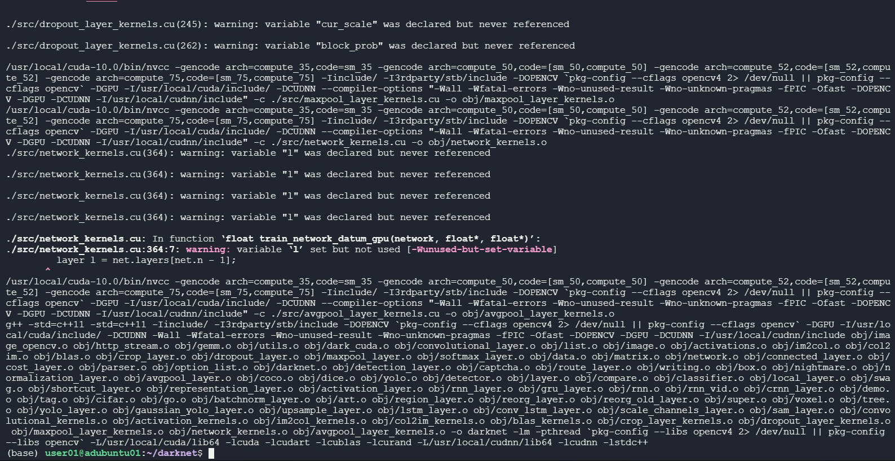

# # YoloV4-with-Nvidia-Tesla-T4-on-Ubuntu-18.04-server
Those steps for setup a YoloV4 with 2 Nvidia graphic cards (NVIDIA Tesla T4) on Ubuntu 18.04 server.

Cuda setup were pain in the neck, more like a shitshow task to do. 
We were 3 “IT professional” trying to make Yolov4 works on ubuntu server for one week (full time) and finally it has worked.
I want to share what we did to make it easier for you :), Because Nvidia did not.

#### I will gather the references of the steps, and thanks for those out there sharing their knowledge and this what helped us make this machine works.

### YoloV4 requirements:
* CMake >= 3.8
* CUDA 10.0 (For GPU)
* OpenCV >= 2.4 (For CPU and GPU)
* cuDNN >= 7.0 for CUDA 10.0 (for GPU)
* OpenMP (for CPU)
* Other Dependencies: make, git, g++


## 1- Install Ubuntu:
- Clean up your old machine from the dust ^^.
- install ubuntu 18.04 Server with the proper configuration for the server (access to ports and on...)

## 2- install the necessary drivers:
- always update your system before any install:
  - `$ sudo apt update`
  - `$ sudo apt upgrade`
  
- If you want to find out info about your GPU card :
  - ` $ sudo lshw -C display `
  
- Find the proper driver for the graphic cards and other PCI Devices (in our case we had just the graphic cards):
  - ` apt search nvidia-driver `
  
- You will get a list of different drivers (Choose the recommended one or not).
  - If you don't want to choose the driver (wants the recommended ) : `$ sudo ubuntu-drivers autoinstall `
  - In case you want some specific driver like the driver for Nvidia and version 460 (on the list): `$ sudo apt install nvidia-driver-460`
  
- Reboot your system, you have to.
  - ` $ sudo reboot `
- Check That GPUs are visible and the install has been successful.
    - ` $ nvidia-smi `
     

**note: you will see the latest version of Cuda listed, just ignore this for now.**

## 3- Install Cuda 10.0 and cuDNN 7.6
Thanks to [Kacper](https://askubuntu.com/questions/1129483/install-nvidia-drivers-with-cuda-10-0-ubuntu-18-04-and-tensorflow-gpu-1-13) his answer was very useful to me. and with this command we installed cuda 10.0 and CUDNN 7.6
- `sudo apt-get install --no-install-recommends \
    cuda-10-0 \
    libcudnn7=7.6.0.64-1+cuda10.0  \
    libcudnn7-dev=7.6.0.64-1+cuda10.0`
    
- **Note: I did this after I installed every thing, in the end**
Now we need our machine to see those versions as defaults, and this will be with add the default path of the NVIDIA (R) Cuda compiler driver path into `.bashrc` file in home directory and by adding those lines in the end:
```
export PATH=/usr/local/cuda-10.0/bin${PATH:+:${PATH}}
export LD_LIBRARY_PATH=/usr/local/cuda-10.0/lib64\{LD_LIBRARY_PATH:+:${LD_LIBRARY_PATH}}
```
save the file.
- test it :
    - `$ nvcc --version`
    
    

## 4- Install OpenCV (latest version), Cmake, gcc and g++
I followed the Documentation of [Open-CV](https://docs.opencv.org/master/d2/de6/tutorial_py_setup_in_ubuntu.html)

- install cmake, gcc and g++:
    `$ sudo apt-get install cmake`
    `$ sudo apt-get install gcc g++`

- I'm using python3:
    `$ sudo apt-get install python3-dev python3-numpy`
     
- Next we need GTK support for GUI features, Camera support (v4l), Media Support (ffmpeg, gstreamer) etc.
    `$ sudo apt-get install libavcodec-dev libavformat-dev libswscale-dev`
    `$ sudo apt-get install libgstreamer-plugins-base1.0-dev libgstreamer1.0-dev`
    
- to support gtk3:
    `$ sudo apt-get install libgtk-3-dev`

- Downloading and install OpenCV:
    `$ sudo apt-get install git`
    `$ git clone https://github.com/opencv/opencv.git`
    `$ cmake ../`
    `$ make`
    `$ sudo make install`
    
- test it:
    `$ opencv_version`
    
## 5- Installing YoloV4
- You can download the YOLO v4 using following command:
    `$ git clone https://github.com/AlexeyAB/darknet`
    
- edit Makefile in the darknet folder :
    `$ nano Makefile -l`
    and change 0s values to 1 in: 
        GPU=1
        CUDNN=1
        OPENCV=1
- The moment of truth is here:
    `$ make`
    
**Note: We tried before this method a different approachs, and we get always an error related to cudnn and coda. but with this method you should get 2 errors like this one :D**


and by following the fix we  deleted this part in darknet source code `network_kernels.o` file and in my case was in line 706: **,cudaStreamCaorureModeGlobal** 
[source](https://www.programmersought.com/article/57107862446/)

I repeated the step `$ make` and we got the expected results:



and:


every things working as should be.

Now: you can download any model you want for testing or train your own model... good luck :)
`$ ./darknet detect cfg/yolov4.cfg yolov4.weights data/image.jpg`

